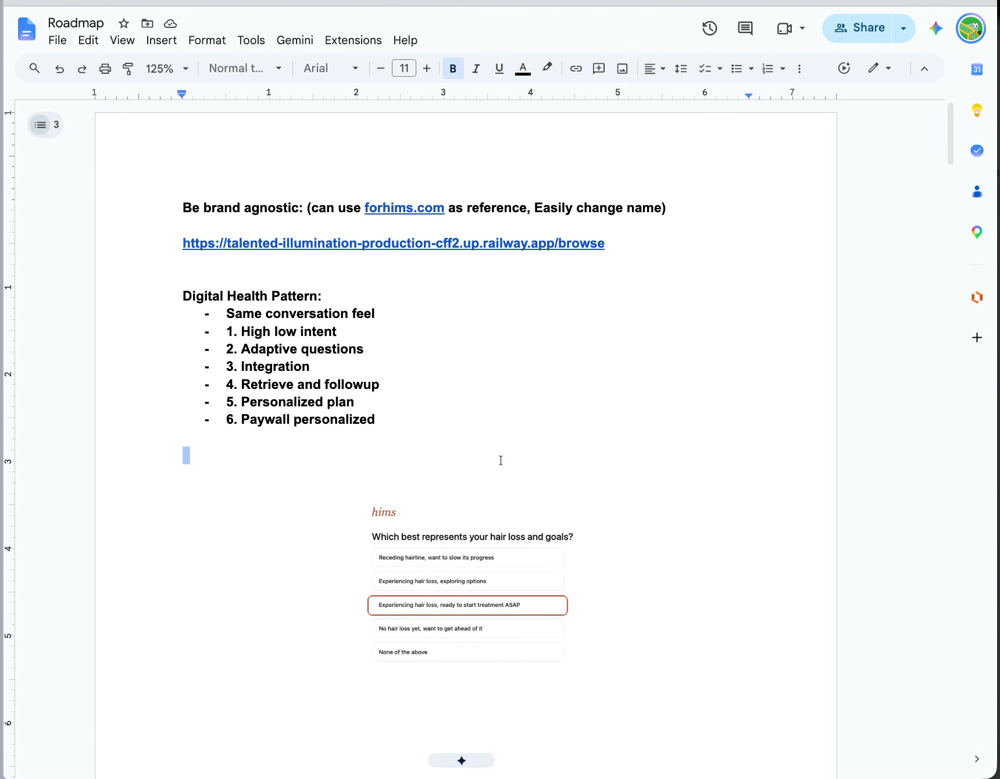
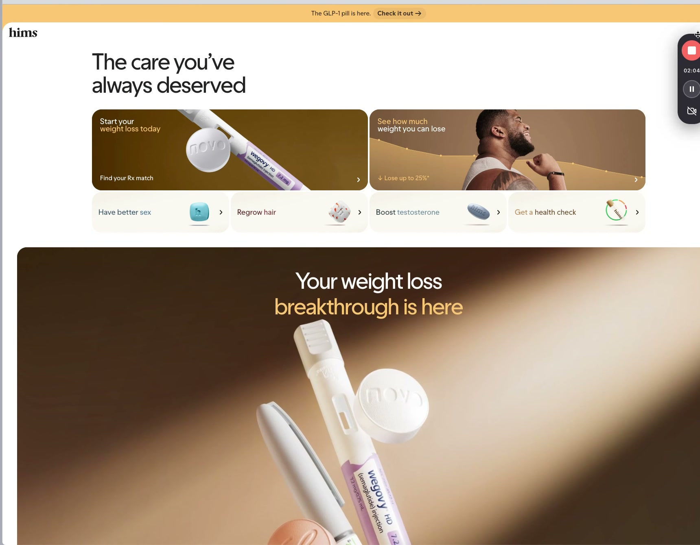
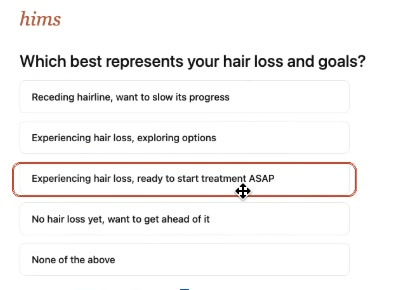
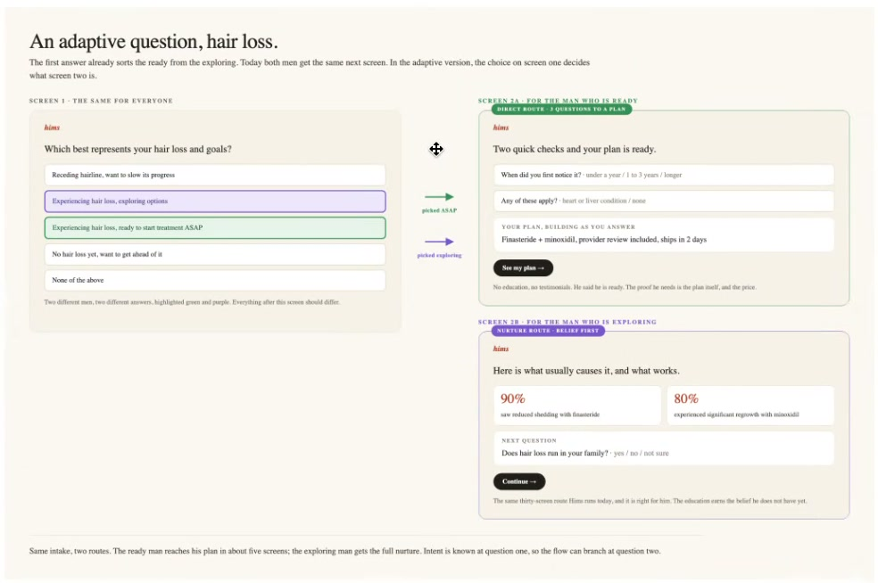
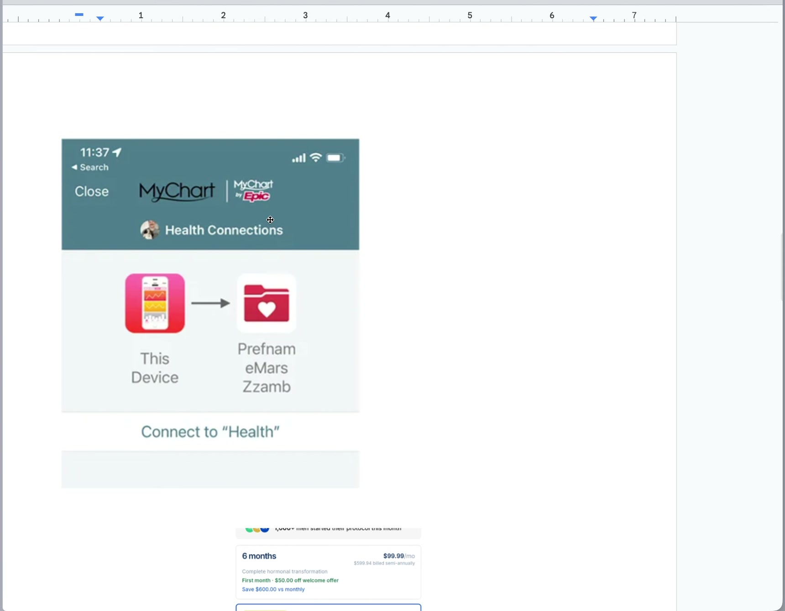
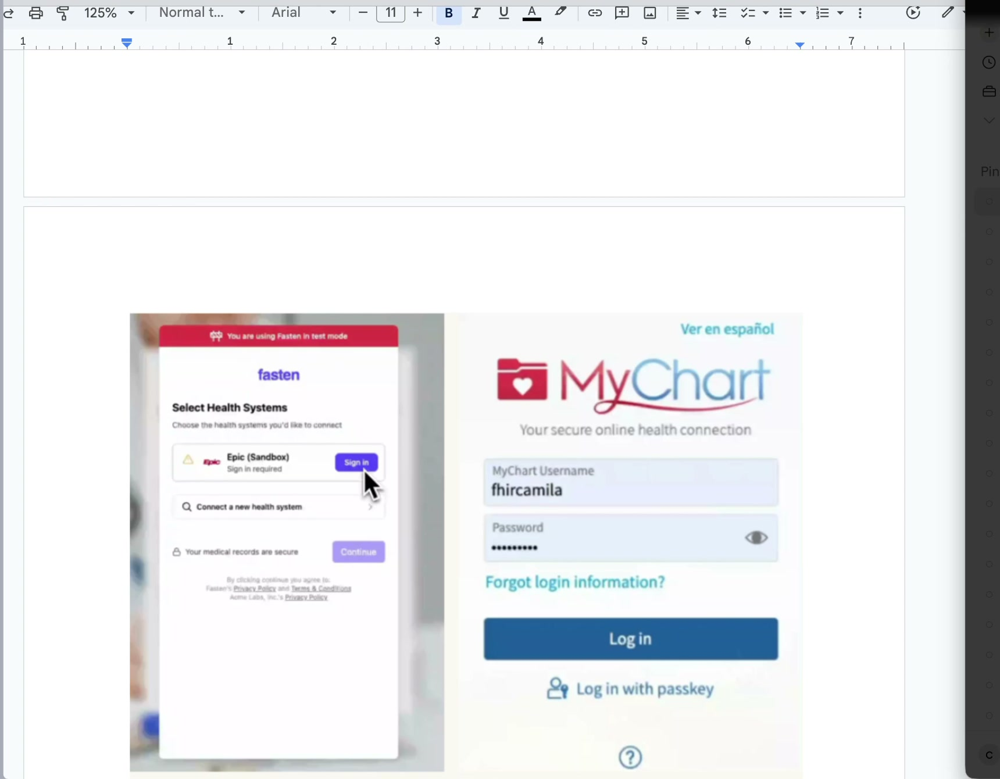
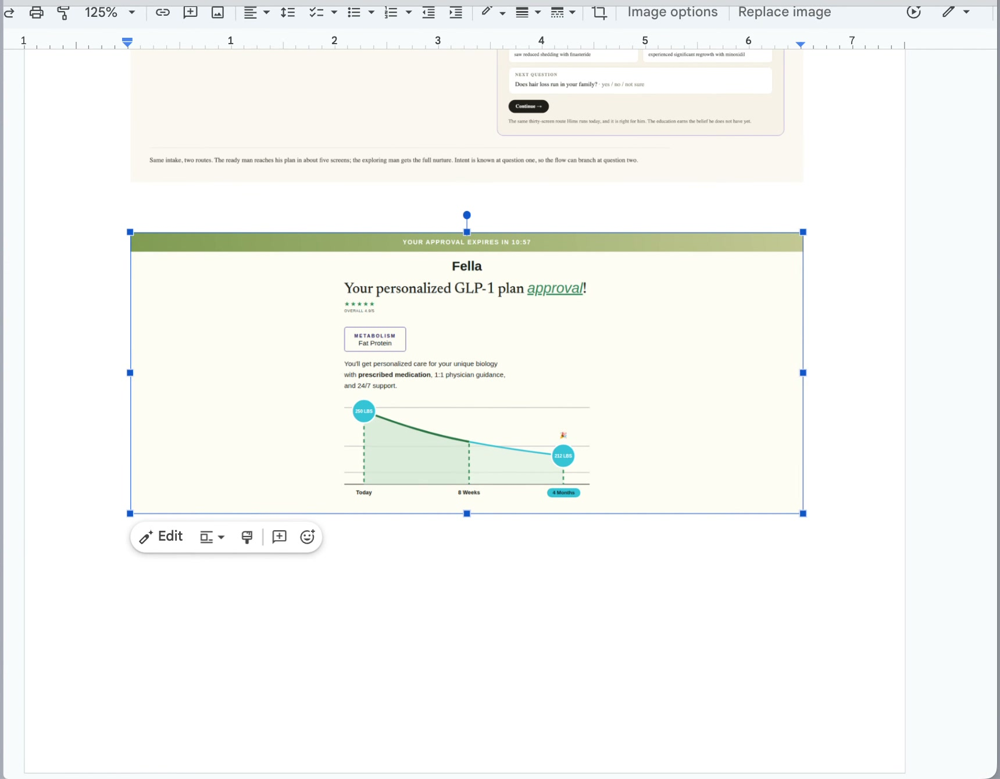
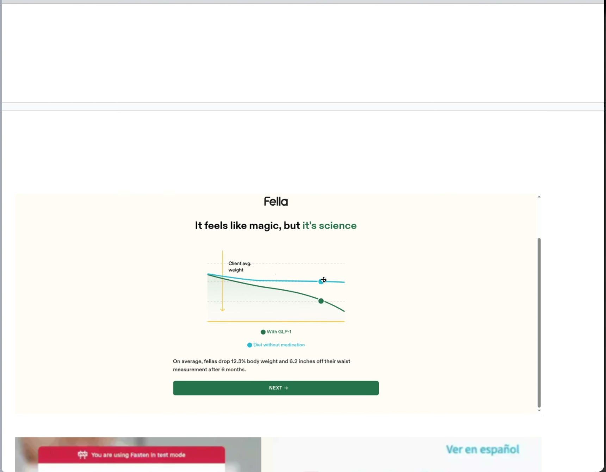
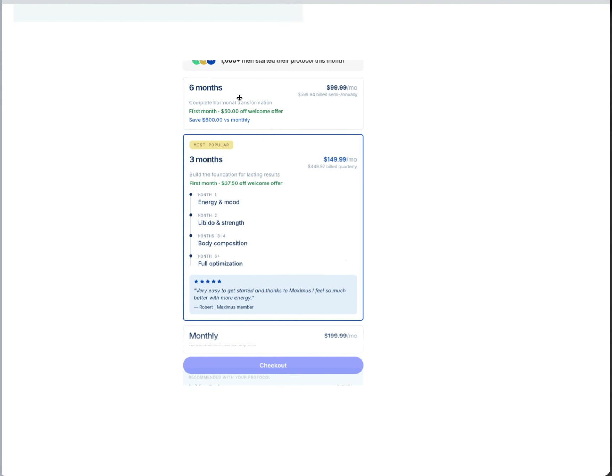

# Digital Health Long-Onboarding Pattern — Video Notes

What the speaker shows on screen, matched to what they say. Companion to [`digital-health-pattern-transcript.md`](./digital-health-pattern-transcript.md).

- **Video:** `~/Downloads/61cc0da8-10ee-48e6-8b1e-3969c1dc527e.mp4` — 9m07s, 3440×1440 ultrawide screen recording, 30 fps
- **Frames:** `media/frames/every5s/` (110 frames, 1 per 5s), `media/frames/scenes/` (85 scene-change frames)
- **Curated references:** `docs/reference-frames/` (named below)

## Screen layout

- **Left:** a Google Doc called **"Roadmap"** (6 pages) — a short outline followed by pasted reference screenshots. This is the spec.
- **Right:** the **TearDown** app (`talented-illumination-production-cff2.up.railway.app/browse` → `~/Documents/evolab/codes/TearDown`) open on **Fella Health (joinfella.com)**, a scraped funnel with 20+ numbered steps (quiz → GLP-1 education → testimonials → state → DOB → BMI → ethnicity → activity…). This is the "30-step long onboarding" example. *(The transcript says "Vital Health"; the screen shows **Fella Health**.)*

## The spec (Roadmap doc, verbatim)

> **Be brand agnostic:** (can use forhims.com as reference, Easily change name)
> https://talented-illumination-production-cff2.up.railway.app/browse
>
> **Digital Health Pattern:**
> - Same conversation feel
> - 1. High low intent
> - 2. Adaptive questions
> - 3. Integration
> - 4. Retrieve and followup
> - 5. Personalized plan
> - 6. Paywall personalized

## Timeline

| Time | On screen | Speaker is saying |
|---|---|---|
| 0:00–1:55 | Roadmap outline + Hims intake question | Intro; Fella as the 30-step example; brand-agnostic, Hims style, easy rename; conversational feel like Deepgram; 6–7 pages; hair loss as the demo vertical |
| 2:00–2:05 | forhims.com homepage | Style reference |
| 2:05–3:30 | Doc; highlights "Same conversation feel", then "1. High low intent"; selects the Hims question image | Concept 1: the first question, where picking **ASAP** sends the user somewhere different |
| 3:35–4:15 | **"An adaptive question, hair loss"** branching diagram | Concept 2: the two routes; "this one has *See my plan* and this one doesn't" |
| 4:20–4:25 | Highlights "3. Integration" | Concept 3: integration, like Plaid/Stripe for banks |
| 4:25–5:00 | MyChart "Health Connections" → Apple Health screenshot | "Import my data… like Apple Health, but it's called MyChart" |
| 5:05–5:35 | Highlights "4. Retrieve and followup", "5. Personalized plan" | Concept 4: "we noticed your blood type is A — when was your last blood test?" |
| 5:40–6:35 | Fella "Your personalized GLP-1 plan approval!" | Concept 5: aha moment = "your personalized hair growth plan is approved" plus a chart |
| 6:40–7:00 | Fasten Connect (test mode) → Epic sandbox → MyChart login | "Here's an example of that MyChart integration, use it as a reference" |
| 7:05–7:35 | Fella "It feels like magic, but it's science" comparison chart | "A chart so you don't have to guess: average loss without the plan vs. much slower with the product" |
| 7:40–8:20 | Maximus paywall (6 months / 3 months / monthly with a month-by-month timeline) | Concept 6: paywall with what happens in month 1, 2, 3–4 |
| 8:25–9:07 | Back to the doc outline; highlights "6. Paywall personalized"; selects the whole list | Wrap-up: "drafty / unpolished is fine as long as it shows every concept" |

## Concept-by-concept requirements

### 0. Global constraints
- **Brand agnostic.** Use the **Hims** look (serif lowercase wordmark, warm cream background, rust-red accent, black pill buttons). The brand name, colors, and logo must be easy to swap, because the demo will be pitched to 4–5 similar companies.
- **No backend or API.** It's all front end (unlike Deepgram).
- **Conversational feel,** same as the Deepgram prototype: one prompt → user reply → next prompt, as a back-and-forth.
- **About 6–7 screens**, using **hair loss** as the vertical throughout.

### 1. High / low intent (screen 1)
Use the Hims question as-is: **"Which best represents your hair loss and goals?"**
- Receding hairline, want to slow its progress
- Experiencing hair loss, exploring options
- **Experiencing hair loss, ready to start treatment ASAP** ← the high-intent answer
- No hair loss yet, want to get ahead of it
- None of the above

Picking **ASAP** must lead to a **different next screen** than the other answers.

### 2. Adaptive questions (screen 2A / 2B)
The diagram pasted in the doc is the spec:
- **2A, direct route ("3 questions to a plan"),** for the user who is ready: "Two quick checks and your plan is ready." Asks *When did you first notice it?* (under a year / 1–3 years / longer) and *Any of these apply?* (heart or liver condition / none). A **"Your plan, building as you answer"** card shows *Finasteride + minoxidil, provider review included, ships in 2 days*. CTA: **See my plan →**. No education and no testimonials.
- **2B, nurture route ("belief first"),** for the user who is exploring: "Here is what usually causes it, and what works." Stat cards: **90%** saw reduced shedding with finasteride, **80%** saw significant regrowth with minoxidil. Next question: *Does hair loss run in your family?* (yes / no / not sure). CTA: **Continue →**.
- Caption: *"Same intake, two routes. The ready man reaches his plan in about five screens; the exploring man gets the full nurture."*

### 3. Integration: "Connect MyChart" (screen 3)
Like Plaid or Stripe for banks, or Apple Health import: a button to **import medical records from MyChart**. References:
- MyChart (by Epic) "Health Connections": This Device → MyChart, "Connect to 'Health'"
- **Fasten Connect** flow: "Select Health Systems" → Epic (Sign in) → MyChart username/password login → "Your medical records are secure" → Continue

### 4. Retrieve and follow up (screen 4)
After import, ask a question that **uses the imported data**. Example: *"We noticed your blood type is A. When did you last get a blood test?"*

### 5. Personalized plan = aha moment (screen 5)
The equivalent of Deepgram's live voice demo. **"Your personalized hair growth plan is approved."**
- Layout reference: the Fella approval screen, which has a countdown banner ("YOUR APPROVAL EXPIRES IN 10:57"), a star rating, a profile tag, a "personalized care… prescribed medication, 1:1 physician guidance, 24/7 support" line, and a Today → 8 weeks → 4 months projection chart.
- **Chart to use:** the Fella "It feels like magic, but it's science" two-line comparison, adapted to hair. Line 1 is **average hair loss without the plan**; line 2 is **with your plan**, where loss is much slower.

### 6. Personalized paywall (screen 6)
Reference: the Maximus paywall. It shows **6 months** ($99.99/mo, billed semi-annually, welcome offer), **3 months, marked Most Popular** ($149.99/mo, with a vertical month timeline and a testimonial), and **Monthly** ($199.99/mo), with a Checkout button.
Hair-loss version of the timeline inside the plan card:
- **Month 1:** shedding stops / thinning slows
- **Month 2:** first visible new growth
- **Months 3–4:** visible new hair coverage
- *(Month 6+: full results)*

The paywall should build on the personalized plan from screen 5.

## Proposed screen sequence

1. Intent question → **ASAP** or **other**
2. 2A direct (2 checks + live plan card) **or** 2B nurture (stats + family-history question)
3. Connect MyChart (Fasten-style picker → login → importing…)
4. Follow-up question built from imported data (blood type A → last blood test)
5. Plan approved + hair projection chart (aha moment)
6. Personalized paywall with month-by-month timeline

## Open questions to discuss

1. **Conversation shell:** reuse the Deepgram prototype's chat component and layout directly, or restyle it fully in the Hims look?
2. **Route merge:** do 2A and 2B both continue to MyChart? Or does ASAP skip ahead (e.g. 2A → plan, with MyChart optional)?
3. **MyChart mock depth:** one "Connect MyChart" button with a fake loading state, or the full Fasten picker → Epic → login → "records imported" summary?
4. **Imported data:** besides blood type, what should appear (medications like finasteride contraindications, liver panel, age, DHT-related history)? This decides how "smart" the follow-up and plan feel.
5. **Chart metric:** y-axis as hair density / hair count / "% of hair retained"? Should the "with plan" line only decline more slowly (as said) or level off and regrow (as the 80% regrowth stat implies)?
6. **Paywall tiers:** keep the 6 / 3 / monthly structure and the Maximus-like prices, or use Hims-like hair pricing?
7. **Brand config:** a single config file (name, logo text, colors, product names) enough for customizing per company?
8. **Deliverable:** hosted on Railway like the Deepgram demo, and ready before the Friday meetings?
